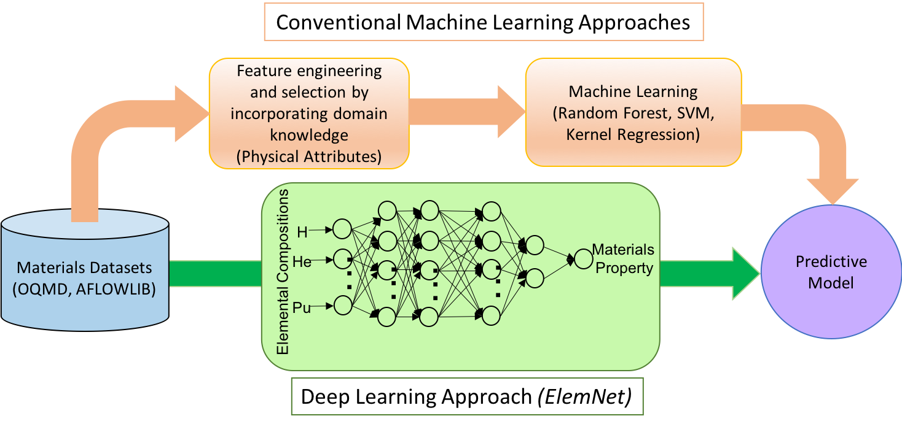

# ElemNet Model
ElemNet was introduced in the papers

1. Dipendra Jha, Logan Ward, Arindam Paul, Wei-keng Liao, Alok Choudhary, Chris Wolverton, and Ankit Agrawal, “ElemNet: Deep Learning the Chemistry of Materials From Only Elemental Composition,” Scientific Reports, 8, Article number: 17593 (2018) [DOI:10.1038/s41598-018-35934-y]  [<a href="https://www.nature.com/articles/s41598-018-35934-y">PDF</a>].

2. Dipendra Jha, Kamal Choudhary, Francesca Tavazza, Wei-keng Liao, Alok Choudhary, Carelyn Campbell, Ankit Agrawal, "Enhancing materials property prediction by leveraging computational and experimental data using deep transfer learning," Nature Communications, 10, Article number: 5316 (2019) [DOI: https:10.1038/s41467-019-13297-w] [<a href="https://www.nature.com/articles/s41467-019-13297-w">PDF</a>].

and the original repository which deals with the model can be found [here](https://github.com/NU-CUCIS/ElemNet/tree/master/elemnet). 
 
A Jupyter notebook for [training](elemnet/train.ipynb) was added and a notebook for inference can be found [here](elemnet/evaluate.ipynb).

## Introduction to the problem
Predicting properties of materials with the help of machine learning is a very interesting and popular topic. 
Classical approaches are often based on **feature engineering** and their success is therefor often strongly depends on domain knowledge. 
This leads to at least two obvious **problems**: Finding and implementing the right features is usually connected with **a lot of work** 
but perhaps the more problematic point is given by the fact that the **relevant physical features** are typically **unknown**.
### Idea of ElemNet
The basic idea of ElemNet is to train a neural net which shall **learn the relevant features** for predicting material properties by using
only the **material composition as input**. More specifically, the model used in this work was trained to **predict the formation energy** (enthalpy) from elemental compositions.

## Model
The model architecture is very simple: The pretrained ElemNet model provided for inference consists of **17 fully-connected layers** (more than 4500000 parameters) with Relu activation and several "very strong" (dropout rates in [0.7,0.9]) **Dropout layers** in between. 
The model **input has shape (number of samples,86)** where 86 corresponds to the number of elements considered for the compositions of materials:
 
['H', 'Li', 'Be', 'B', 'C', 'N', 'O', 'F', 'Na', 'Mg', 'Al', 'Si', 'P', 'S', 'Cl', 'K', 'Ca', 'Sc', 'Ti', 'V', 'Cr', 'Mn', 'Fe', 'Co', 'Ni', 'Cu', 'Zn', 'Ga', 'Ge', 'As', 'Se', 'Br', 'Kr', 'Rb', 'Sr', 'Y', 'Zr', 'Nb', 'Mo', 'Tc', 'Ru', 'Rh', 'Pd', 'Ag', 
'Cd', 'In', 'Sn', 'Sb', 'Te', 'I', 'Xe', 'Cs', 'Ba', 'La', 'Ce', 'Pr', 'Nd', 'Pm', 'Sm', 'Eu', 'Gd', 'Tb', 'Dy', 'Ho', 'Er', 'Tm', 'Yb', 'Lu', 'Hf', 'Ta', 'W', 'Re', 'Os', 'Ir', 'Pt', 'Au', 'Hg', 'Tl', 'Pb', 'Bi', 'Ac', 'Th', 'Pa', 'U', 'Np', 'Pu']
 
The input entries correspond to the relative fraction which the respective element contributes to a certain compound (implying that the sum over all values equals 1). Thus, the input arrays are typically very sparse. In case of 'H20' for example
the entry for the 'H' component is 0.66, the entry for the 'O' component 0.33 and all remaining ones are 0.
  The **output** of the model has shape **(number of samples,1)** and corresponds to the predicted enthalpies for the different samples.
### Model training and performance
For training and testing OQMD10 dataset was used which is
openly available at [http://www.oqmd.org](http://www.oqmd.org). 
OQMD is a database which contains crystallographic parameters derived  by DFT computations for more than 250000 unique compositions.
ElemNet achieves a MAE of approximately 0.050 eV/atom (corresponding to roughly 9% mean absolute deviation) on the test set which outperforms 
the classical feature-based approaches considered in [[1]](https://www.nature.com/articles/s41598-018-35934-y).
   
The authors show additionally that ElemNet has the potential to support the search for new/unobserved materials. Due to the high accuracy and the fast inference velocity,
plausible enthalpy values can be predicted for a hugh amount of hypothetical compounds to obtain indicators for their stability. 
