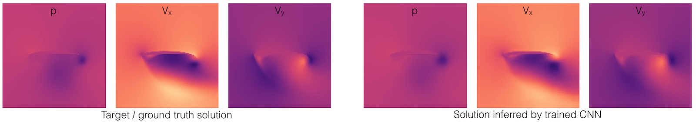
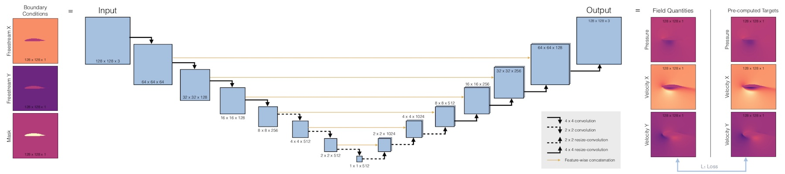

# Deep-Flow-Prediction 

_Deep Flow Prediction_ is a framework for fluid flow 
(Reynolds-averaged Navier Stokes) predictions with deep learning and is described in detail in the paper:
<https://arxiv.org/abs/1810.08217>

Contributing authors:
*N. Thuerey, K. Weissenow, H. Mehrotra, N. Mainali, L. Prantl, Xiangyu Hu*

The authors' TUM lab website with additional physics-based deep learning works can be found at
<https://ge.in.tum.de/research/>.

This work is based on a copy of their repository which can be found at <https://github.com/thunil/Deep-Flow-Prediction/>.

# Introduction to the problem
Reynolds-averaged Navier-Stokes equations (RANS) are a simplified version of the well-known Navier-Stokes equations. 
The aim of the work is to predict approximation solutions for these equations with the greatest possible accuracy using a deep neural network. 
The motivation to use deep learning for this task is the (usually) by many orders faster inference time compared to classical solution methods. 
The challenge, on the other hand, is finding a framework where deep learning yields comparably accurate solutions. 

# Model

The Model is based on a U-net architecture which is actually a standard architecture for segmentation problems. 
It consists of an **encoder** which **downsamples the image** in several steps while adding channels for **feature extraction**
followed by a **decoder** where the image is **upsampled to original size**. A peculiarity of the U-net architecture is the **symmetric structure** in which for each
encoder layer a corresponding decoder layer with the same shape exists. During the upsampling process **corresponding encoder and decoder outputs are concatenated** previous to 
generating the next output. Heuricstically, the idea of this approach could be sketched as follows:
 
During encoding local information is aggregated to global features. During the decoding process local information
encoded in previous layer outputs is combined with global features to generate the output image.
## Why is this a suitable architecture for generating approximate solutions to PDEs?
The most obvious tensor representation of a solution to a PDE in 2-dimensional space is an image with a suitable number of channels. 
We therefore need a model that can aggregate and process information and ultimately assign it to the respective target pixels with high precision.
Hence, the **requirements** are basically the **same as for segmentation** problems where using U-net is probably the most successful approach.
 
From another perspective **PDEs are problems of finding global functions given local conditions** (resp. conditions on the function's partial derivatives) as well as **boundary conditions**. 
The **convolutional layers** of the encoder correspond exactly to the idea of **aggregating local information** stepwise from a very fine to a rather coarse perspective (downsampling).
The **precise assignment** of the information can then be **handled by the symmetric U-net structure** which allows to access information of previous 
layer outputs (with more local information) at later stages. 
## Details of the applied layers:
According to the symmetry of the architecture encoder and decoder consist of the same number of convolutional blocks
(resp. 7 in case of the pretrained model).
 
**Layer blocks of encoder:** Convolutional layers with stride 2 (needed for downsampling) and kernel size 4 followed by LeakyRelu activation 
 
**Layer blocks of decoder:** Simple Upsampling layer (factor 2) followed by Convolutions with stride 1 and kernel size 3 as well as Relu activation 
 
In both cases batchnorm is used after the convolutional layers. 
## Training of the model:
### Training Data:
The ground truth samples for training and testing are calculated with the open source code OpenFOAM and are povided as 128x128x3 images
where the first channel describes the pressure field, the second channel the velocity field in x-direction an the last channel the velocity field in y-direction. 
The model used for inference was trained on 51k such samples. One of the most crucial parts for successful training is 
the way the freestream conditions and the airfoil shape are prepared as the model input.  
The input tensor is also of shape 128x128x3 where the first two channels describe the freestream velocities in x and y direction (this corresponds to the distant velocity field which can be assumed to be uneffected by the airfoil)
and the third is containing a mask of the airfoil geometry. 
#### Important points for data preprocessing and provision: 
1. The units of **velocity** input channels are **initialized** constantly **according to the freestream values** with exception of the units 
where the airfoil is located which are initialized to zero. Thus, geometric information and boundary conditions are encoded redundantly
which shall provide a **faster information propagation**: If in contrast to the authers' approach the freestream values would e.g. only be placed in the 
boundary units, then the information flow bringing together information about airfoil shape and boundary conditions would need several convolutional blocks due to their local nature.
2. According to the authors **switching to dimensionless quantities** turns out to lead to significantly **improved results**. 
This approach is used for differential equations in different contexts and often leads to further insights or simplifications. In the current case
the authors replace the target quantities vx, vy and p by 
vx/vx0, vy/vy0 and p/|vx02+vy02| where vx0, vy0 refer to the freestream conditions.
Especially the rescaling of the pressure turns out to be crucial. While it is not obvious that this approach is in general advantageous, it is in any case a trick which should be kept in mind.
In addition the mean pressure is subtracted of the pressure values so that its mean becomes 0.
3. **Normalizing** the values of the 3-channels (for input and target tensors) to the range [-1,1] by **dividing** the sample tensors **by the biggest absolute value** appearing in the dataset for the respective channel turns out
to bring some further benefit. 
### Training framework:
While the previous preparations turn out to have great influence on the obtained results, no real surprises are observed regarding the general training settings.
The only interesting point is choosing the best working objective. In this work MAE (mean absolute error) loss was applied which in other contexts often turns out to be a suboptimal measure for the 
closeness of image tensors. A slightly shifted version of the same image can potentially lead to large MAE losses though in many contexts the images would be regarded as
'very close' to each other: While slightly shifted images would be considered "close" in case of e.g. "cat pictures", it is far less obvious whether this is also the case for the current context.
Moreover, alternative losses like perceptual loss (resp. feature loss) which is sometimes applied to avoid this problem are no suitable choice here because an appropriate pretrained network is not available
(and would probably also not provide the right measure of closeness without further adjustment).
### Test evaluation:
For evaluation the authors take relative MAE as a measure which means that the absolute MAE value is divided by the average target value. 
Testing was done on a sample of 90 generated images using 30 airfoil shapes which did not appear in the training data. The average relative error across all three ouput channels is at 2.6% for the model used in the evaluation notebook.  
The relative errors for the respective channels are 2.15% for the x velocity channel, 2.6% in y direction and 14.76% for the pressure values and are thus not evenly distributed. The authors claim that the large amount of small pressure values 
with fewer large spikes lead to increased relative errors for the pressure channel. Moreover, it is noticeable that the relative error which is obtained by considering 
all 3 channels at the same time, is of the same magnitude as the relative velocity errors. 
This implies that absolute deviations are of the same magnitude for all three channels while relative deviations are much larger for the pressure and indicates that a separate evaluation of the channels makes more sense
for the applied metric.

