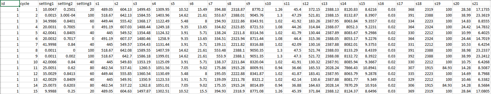
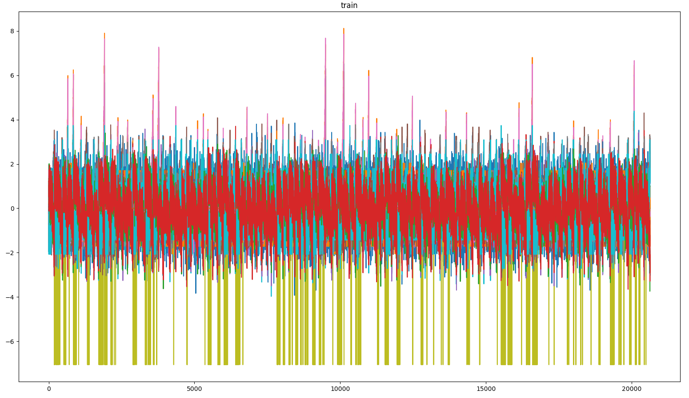
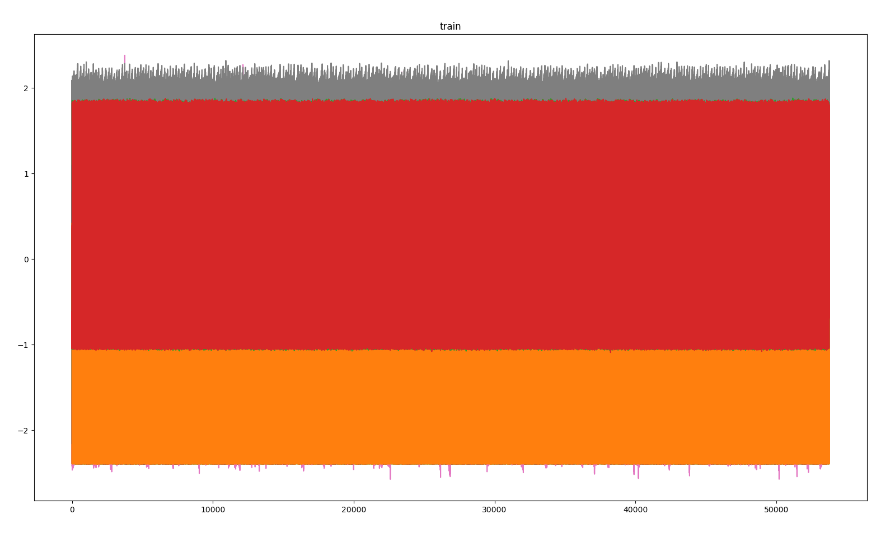
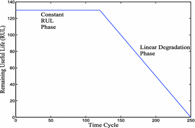
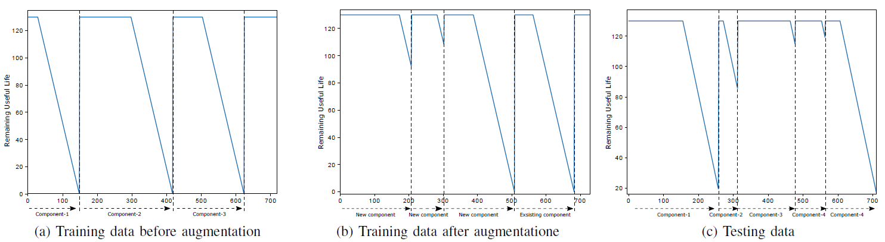

# RUL-Net
This repo is based on a copy of [RUL_NET](https://github.com/LahiruJayasinghe/RUL-Net). A notebook for model inference and training is added.
The code of the notebook is compatible with tensorflow 2.
<br>
The repo deals with a state-of-the art deep learning model for estimating Remaining Useful Life (RUL) of an engine.
The dataset used for testing is CMAPSS which was introduced for PHM08 prognostic challenge.
The datasets can be donwloaded from: https://ti.arc.nasa.gov/tech/dash/groups/pcoe/prognostic-data-repository/#turbofan 

For further details, please see the paper [Arxiv paper](https://arxiv.org/pdf/1810.05644.pdf) related to the original repo.

## Model

<br>
The model takes a batch of shape **(batch_size,sequence_length,24)** where 24 corresponds to the number **input features (sensor values plus settings)** and the **sequence length is set to 100** (empirically determined).
<br>
The **processing steps** of the model can be summarized as follows:
<br>

1. Feature extraction by temporal convolutions (Conv1d) and MaxPooling (==> temporal dimension is downsampled)
2. Upsampling of time dimension by first flattening the units:
**(batch_size,time,feats)==>(batch_size,time*feats)**,
applying a Dense Layer on the flattend array with appropriate output units so that a sequence of shape (batch_size,100,new_feats_dim) can be formed again.
3. Further feature extraction and information propagation along the time axis by LSTM layers.
4. Processing of the feature information for each time step separately by a sequence of Dense layers


For regularization classical Dropout layers are used.
<br>
For further details the related [Arxiv paper](https://arxiv.org/pdf/1810.05644.pdf) or the implementation of the RulModel class in the provided notebook can be checked.


## Dataset discription
The main and largest dataset is the CMAPSS dataset. It contain four subdatasets called FD001, FD002, FD003, and FD004

| Dataset | Train trajectories | Test trajectories | Conditions | Fault Modes |
| ------- | ------------------ | ----------------- | ---------- | ----------- |
| FD001 | 100 | 100 | ONE (Sea Level) | ONE (HPC Degradation) |
| FD002 | 260 | 259 | SIX | ONE (HPC Degradation) |
| FD003 | 100 | 100 | ONE (Sea Level) | TWO (HPC Degradation, Fan Degradation) |
| FD004 | 248 | 249 | SIX (Sea Level) | TWO (HPC Degradation, Fan Degradation) |

Data sets consists of multiple multivariate time series. Each data set is further divided into training and test subsets. Each time series is from a different engine – i.e., the data can be considered to be from a fleet of engines of the same type. Each engine starts with different degrees of initial wear and manufacturing variation which is unknown to the user. This wear and variation is considered normal, i.e., it is not considered a fault condition. There are three operational settings that have a substantial effect on engine performance. These settings are also included in the data. The data is contaminated with sensor noise.

The engine is operating normally at the start of each time series, and develops a fault at some point during the series. In the training set, the fault grows in magnitude until system failure. In the test set, the time series ends some time prior to system failure. The objective of the competition is to predict the number of remaining operational cycles before failure in the test set, i.e., the number of operational cycles after the last cycle that the engine will continue to operate. Also provided a vector of true Remaining Useful Life (RUL) values for the test data.

### Dataset structure 

The data provieded as text file with 26 columns of numbers, separated by spaces. Each row is a snapshot of data taken during a single operational cycle, each column is a different variable. The columns correspond to:
1)	unit number
2)	time, in cycles
3)	operational setting 1
4)	operational setting 2
5)	operational setting 3
6)	sensor measurement  1
7)	sensor measurement  2
...
26)	sensor measurement  26



After standard normalization of data in time domain 

| Dataset | Visualization |
| ------- | --------------|
| FD001 and FD003|  |
| FD002 and FD004|  |

The distribution of FD001 and FD003 has similarities as well as the FD002 and FD004 datasets.
## Data labeling
Machine health is inversely proportional to the engine cycles. 
When number of engine cycles are increasing, then the machine health should decrease. 
It can be model as a linear function but here we use a piece-wise linear function. 
Hence, the basic assumption is that first few cycles have the maximum health of the machine (corresponding to the 
horizontal line in the plot) and then it starts to decrease linearly.  
  

## Training data augmentation



If we concatanate all the training labels and testing labels its looks like this (a) and (c)
It’s clear that the training labels always goes to zero RUL but testing labels need not to go zero RUL. 
Therefore, model must see something like testing data to get a good perdition. 
The authors of the original repo implemented a data augmentation technique to make the training data looks like testing data, which increases the accuracy. 
More details can be found in the [paper](https://arxiv.org/pdf/1810.05644.pdf).

### Citation

If this is useful for your work, please cite the [Arxiv paper](https://arxiv.org/pdf/1810.05644.pdf):

```bibtex
@article{jayasinghe2018temporal,
  title={Temporal Convolutional Memory Networks for Remaining Useful Life Estimation of Industrial Machinery},
  author={Jayasinghe, Lahiru and Samarasinghe, Tharaka and Yuen, Chau and Ge, Shuzhi Sam},
  journal={arXiv preprint arXiv:1810.05644},
  year={2018}
}
```
### License
This is released under the MIT license. For more details, please refer
[LICENSE](https://github.com/LahiruJayasinghe/RUL-Net/blob/master/LICENSE).

"Copyright (c) 2018 Lahiru Jayasinghe"
