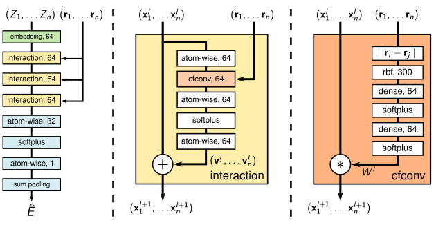

# SchNet - Deep learning for predicting molecular properties
The repo is based on a clone of the [Schnet repository](https://github.com/atomistic-machine-learning/SchNet) which deals with 
the model introduced in:
 

*K.T. Schütt. P.-J. Kindermans, H. E. Sauceda, S. Chmiela, A. Tkatchenko, K.-R. Müller.  
SchNet: A continuous-filter convolutional neural network for modeling quantum interactions.*  
Advances in Neural Information Processing Systems 30, pp. 992-1002 (2017)
 

*K.T. Schütt. F. Arbabzadah. S. Chmiela, K.-R. Müller, A. Tkatchenko.  
Quantum-chemical insights from deep tensor neural networks.*  
Nature Communications **8**. 13890 (2017)   
doi: [10.1038/ncomms13890](http://dx.doi.org/10.1038/ncomms13890)
 

SchNet is a deep learning architecture used to predict quantum-mechanical observables of atomistic systems.
The repo contains a [Jupyter notebook](src/train.ipynb) which trains a SchNet model to predict the energy U0 of molecules of the  QM9 dataset and
a [notebook for inference](src/eval.ipynb).

## Introduction
Training a model to predict properties of molecules is connected with several difficulties. Perhaps the most crucial challenge is
the **varying number of atoms** forming a molecule combined with the **missing order**. While the first point alone could be easily handled 
by using a sequence model, the combination of both suggests other approaches. A reasonable method is to translate the
 molecules to graphs in which the atoms are the nodes (described by features) and the interactions between them are described as edge features. 
 Architectures of that structure are typically referred to as  **graph neural networks**. For the task of predicting the properties
 of molecules a appropriate architecture should fulfill further conditions: For example  **permutation invariance** of same
 atom types as well as **invariance under rotation and translation** of the molecule should be integrated in the model architecture. 
 Moreover, the architecture should provide the model the possibility to learn important geometrical properties like distances and angles
 between atoms. SchNet is designed to fulfill all these requirements.
 ## Model Architecture
 In the [paper](https://arxiv.org/pdf/1706.08566.pdf) introducing the architecture, SchNet is sketched as follows:
  
 
  
 There are two basic types of layers: Layers which operate (in parallel) on each atom separately (==> processing without 
 information exchange between atoms) and layers where each atom "branch" is updated with information of the other "branches" 
 (==> necessary for learning geometrical properties).
 1. First the atoms get an embedding vector depending on their atomic number Z. 
 2. Subsequently, 3 interaction blocks follow where the model 
 learns the geometry of the molecule. The coarse structure of the interaction block is shown in the middle sketch. 
 It consists of several atom-wise operations and a so called 'continuous filter convolutional layer' where the information
 exchange between atoms takes place. The information input to the interaction blocks are the (processed) embedding vectors
 of the atoms *xi* and their coordinates *ri*. The position vectors are processed such that
 each atom vector *xi* is updated with information about the relative distances  *|ri-rj|* to all remaining atoms.
 Since only the relative distances  *|ri-rj|* are used during the updating process, rotational and translation invariance are
 are inherent in the model architecture.
 3. After the interaction blocks the updated atom vectors *xi*  are further processed (atom-wise) before finally the 
 information of the different atom vectors is merged by summation (sum pooling) so that a single prediction for the energy is obtained. 

    
## QM9 Dataset

For training and evaluation the QM9 dataset is used which is introduced in: 
 

L. Ruddigkeit, R. van Deursen, L. C. Blum, J.-L. Reymond, [Enumeration of 166 billion organic small molecules in the chemical universe database GDB-17](https://pubs.acs.org/doi/abs/10.1021/ci300415d)
, J. Chem. Inf. Model. 52, 2864–2875, 2012.
 
R. Ramakrishnan, P. O. Dral, M. Rupp, O. A. von Lilienfeld, [Quantum chemistry structures and properties of 134 kilo molecules](http://www.nature.com/articles/sdata201422), Scientific Data 1, 140022, 2014. 
 

The database contains geometric, energetic, electronic, and thermodynamic properties for 134k stable organic molecules which were calculated using density functional theory (dft).

    
 
