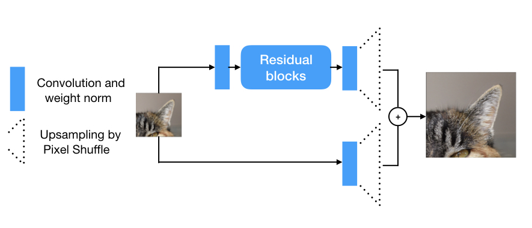
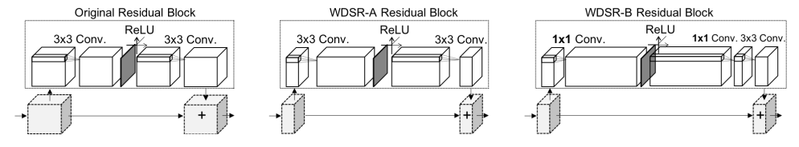

# Image Super-Resolution with WDSR network
Code and content of this repository are based on a clone of https://github.com/krasserm/super-resolution which is 
concerned with the super resolution method presented in 
[Wide Activation for Efficient and Accurate Image Super-Resolution](https://arxiv.org/abs/1808.08718) (winner in the realistic tracks 
of the [NTIRE 2018](http://www.vision.ee.ethz.ch/ntire18/) super-resolution challenge) and other super resolution techniques.
 
The notebook [evaluation.ipynb](evaluation.ipynb) can be used to test the pretrained WDSR model.

# Introduction to the problem 
Super resolution are methods that are used to improve the resolution and quality of images. 
In recent years, deep learning has proven to be a particularly efficient and successful approach to this task with rapid progress.
There is a wide area of applications of such methods including scientific fields which are for example concerned with microscopic, satellite or medical imaging.
For a general introduction to the topic the notebook
[article.ipynb](article.ipynb) provided by the authors of the original repository is highly advisable. 
# The Model 
## The architecture from a coarse-grained perspective

As indicated in this sketch the super resolution process is separated in branches 
which are merged in the end by adding the respective outputs. 
 
One of these branches consists basically of a single **convolution layer with weight normalization**
followed by a **pixel shuffle layer** for upsampling. The purpose of this simple branch is therefore primarily
 the provision of an upsampled version of the original image which results in a **base image** that can be enhanced by **addition of details** provided **by the second branch**.
 
The second branch on the other hand is much more complex and consists of a **sequence of simple convolutions (with weightnorm) and residual blocks** followed by **pixel shuffle layer** for upsampling at the end.
These more complex operations provide the possibility for **feature generation** which finally can be **added to the "base image"** obtained by the first branch. 
The upsampling process was put after the computational heavy operations by the authors to keep the necessary resources as low as possible (**Post-upsampling**).
  The exact upsampling mechanism provided by "pixle shuffle" can be found in [this link](https://www.tensorflow.org/api_docs/python/tf/nn/depth_to_space) and in the section "Upsampling layer" in the notebook
[article.ipynb](article.ipynb). 
 
The authors prefer weight normalization for their network over batch normalization because it delivers distinctly better results for the current use-case.
As potential reasons for that, they mention the possibly large fluctuations in the batch statistics which may lead to unstable training. 
More specifically, during training batch normalization depends on the mean and standard deviation for the respectively considered batch which might change significantly
due to the relatively small batch size (e.g. 16) which is typically used for computationally heavy tasks like super resolution.

## Residual blocks with wide activation
The main insight of the work is that residual blocks with **"feature expansion" previous to the activation layer** leads to significantly **improved results**.
 
The authors introduce two mechanisms for such a "feature expansion":

The image on the left shows a **traditional residual block** where the number of feature channels keeps constant for all layers in the block.
  
The sketch in the middle shows the first option how the authors modified this classical block and the related network is referred to a **WDSR-A**. The **convolutional layer** previous to the Relu activation **increases the number of feature
channels** by a certain factor (between 2 and 4) while the **subsequent convolution "compresses"** the tensor so that output and original block input have again the same shape and can be added. For proving that the widening process is
the reason for the performance boost (and not just the larger number of parameters), the authors decreased the number of the input feature channels (sketched by the smaller block in the middle picture) so that in total
the parameter numbers for both blocks remain in the same order odf magnitude.
  
The network related to the widening mechanism of the third sketch is referred to as **WDSR-B**: In contrast to  WDSR-A **1x1-convolutions are applied** previous and next to the activation layer 
which keeps the parameter number lower. As trade-off no spatial information is shared by the 1x1-convolutions. Thus, a further **3x3 convolutional layer is added in the end** to provide the possibility of  **local "information exchange"**. 
 
The **general idea** of these widening blocks according to the authors can be summarized as follows: **Increasing the number of units** previous to the Relu activation simplifies the information flow
through the residual blocks so that in total **more feature information** (in particular of early/shallow layers) **can be propagated** through the whole model.
 
The **provided pretrained model** uses **WDSR-B** residual blocks and has **8 such blocks** in total which respectively have a **widening factor of 6**.
## Training of the model
### Data
The WDSR models was trained on DIV2K dataset which consist of **low resolution (LR)** and **high resolution (HR)** image pairs with a large diversity of contents. The image pairs can be **generated by** application of different downgrade functions where for the pretrained model **bicubic downsampling** was used.
Thus, the model is essentially trained to approximate the inverse of the respectively applied downsampling function with best possible precision. This strongly suggests that the training of a super resolution model for a 'real world use-case' may be hard if the relation 
between LR and HR images differs strongly from the usual downsampling functions since pairs of input and related target images are typically barely available.
  
800 image pairs were used for the training and another 100 pairs for validation where the training set
 was augmented using random crops, flips and rotations.
### Loss function and metric
Using the right loss function and especially metric is a non-trivial problem since their is **no unique metric** to measure something subjective
like the quality of an image. The **simplest** and especially in the past **most common** losses/metrics are **pixel losses** where the distance
between output and target pixels (usually MAE or MSE) are used. These measures, however, have the weakness that slightly shifted images
might be 'far away' in terms of pixel loss though from a human perspective they would be considered as close. Moreover, no difference is made
regarding the quality if important features and background. In practice, these shortcomings often lead to poor perceptual quality due to lack of realistic textures and blurring.
**Alternative** approaches are **perceptual loss** functions (feature loss) or/and **GANs**, which are more complex, but which are normally expected to have greater potential for image enhancement.
However, the WDSR model was trained to minimize the mean absolute error (MAE) between images therefore shows that very good quality can also be achieved with pixel loss.
